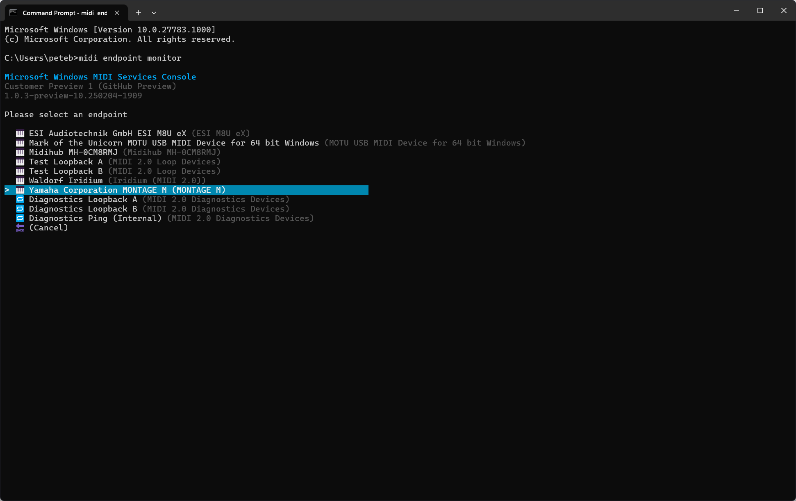
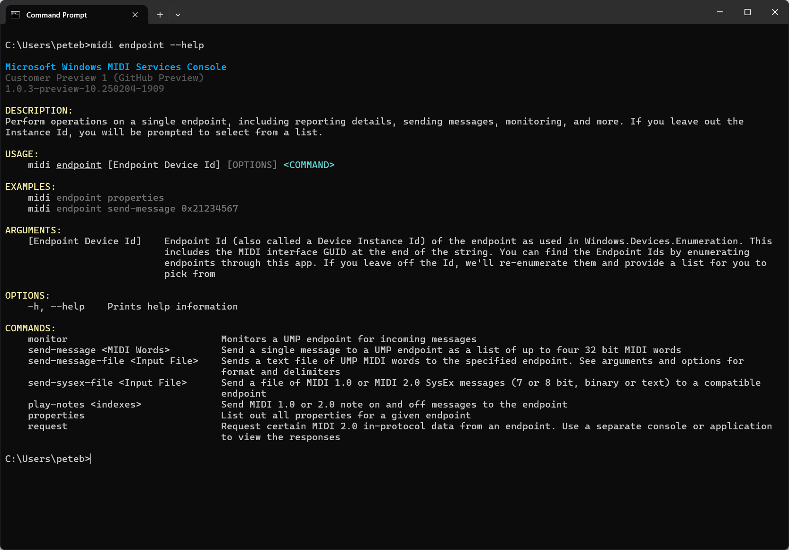
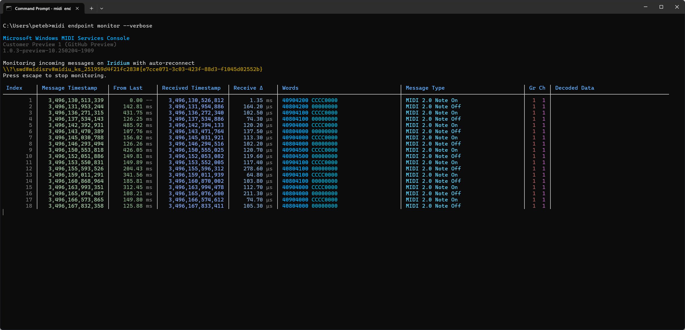

# Single-Endpoint Commands

There are a number of commands, including those for monitoring and sending messages, which operate on a single endpoint.

In most any command which takes an Endpoint Device Id as a parameter, that parameter is optional. If you leave it out, and the command operates on a single endpoint, you will be prompted with a menu of available endpoints to work with.



If you want to script the commands without requiring any user interaction, provide the endpoint device ID as the first parameter after the `endpoint` command. For example:

```
midi endpoint \\?\SWD#MIDISRV#MIDIU_DIAG_LOOPBACK_B#{e7cce071-3c03-423f-88d3-f1045d02552b} properties --verbose
```



## Get Detailed Endpoint Properties

In the Device Manager in Windows, you can only see a subset of properties for a device. The same goes with the `pnputil` utility. It can be useful to see all of the key properties of a MIDI Endpoint. Therefore, we've baked property reporting right into the MIDI Services Console.

```
midi endpoint properties
```

By default, only key properties are displayed. If you want to see the complete list of all properties for the endpoint device, its container, and its parent device, add the `--verbose` parameter.

```
midi endpoint properties --verbose
```

As with other endpoint commands, if you provide the endpoint device Id, it will be used. Otherwise, you will be prompted to select an endpoint.

## Monitor an Endpoint for Incoming Messages

By default, every UMP Endpoint in Windows MIDI Services is multi-client. That means that more than one application can open a connection to the endpoint and send and/or receive messages. This also makes it possible to monitor all the incoming messages on an endpoint, even when that endpoint is in use by another application.

When run in `verbose` mode, the monitor will display each message as it arrives. It also displays helpful information about the type of the message, the group and channel when appropriate, the timestap offset (from the previous message if it was received recently), and more. This requires a fairly wide console window to allow formatting each message to take up only a single line. In a narrow window the format will be a bit ugly. We recommend using the [Windows Terminal application](https://apps.microsoft.com/detail/9N0DX20HK701), which has support for zooming in and out using the mouse wheel, different fonts, and more.

When run without the `--verbose` option, the monitor displays only key data for the incoming messages.

Default mode:

```
midi endpoint monitor
```

Verbose mode:

```
midi endpoint monitor --verbose
```



### Saving messages to a file

When monitoring, you also have the option to save the messages to a file. This can be used to capture test data which you will send using the `send-message-file` command, or for storing something like a System Exclusive dump.

```
midi endpoint monitor --capture-to-file %USERPROFILE%\Documents\MyMidiCapture.midi2 --annotate-capture --capture-field-delimiter Pipe
```

- The annotation option puts a comment before each message line, with additional details, including the timestamp.
- The delimiter option enables you to specify how to delimit the MIDI words in the file. By default, the words are delimitated with spaces.

> The file you choose to write to will be appended to if it already exists. Use caution when specifying the file name, so that you don't corrupt an unrelated file with this MIDI data.

If no file extension is specified, the extension `.midi2` will be automatically added to the filename.

When you have completed monitoring an endpoint, hit the `escape` key to close the connection and the app.

## Send a Message from the Command Line

Sending a message to an endpoint is very helpful for testing, but can also be used in automation to, for example, change the current program, or set a MIDI CC value. It would be very easy for a person to build a batch file or PowerShell script which used midi.exe to synchronize different devices, or reset devices to a known state in preparation for a performance.

The message data beyond the message type (first 4 bits) is not pre-validated, so the data can be anything. However, the number of 32 bit words must match the message type per the MIDI 2.0 specification.

Send a single UMP32 message immediately

```
midi endpoint send-message 0x21234567
```

Send a single UMP64 message ten times

```
midi endpoint send-message 0x41234567 0xDEADBEEF --count 10
```

Send a single UMP64 message fifteen times, but with a delay of two seconds (2000 milliseconds) in between each message. Delays are in milliseconds because they are there primarily to prevent flooding with older devices.

```
midi endpoint send-message 0x41234567 0xDEADBEEF --count 15 --pause 2000
```

In general, we recommend sending messages in hexadecimal format (prefix `0x` followed by 8 hexadecimal digits)as it is easier to visually inspect the information being sent. The 1-4 MIDI words are in order from left to right, from 1 to 4. 

### Special debug messages

One thing that can be useful is to send otherwise valid UMP messages where the last word is incremented by 1 for each sent message. This helps to validate that all messages were received by your application, and in the correct order. Note that this requires a message type of at least two words. We don't recommend sending Type F stream messages as those have the potential to corrupt data. Instead, a Type 4 MIDI 2.0 channel voice message is usually safer.

```
midi endpoint send-message 0x41234567 0x00000000 --count 10000 --pause 2 --debug-auto-increment
```

When sent, you should see messages where the second word is updated from `0x00000000` through `0x00002710` (decimal 10000). We recommend the pause when sending large numbers of messages because a pause of 0 ("send as fast as possible") can flood the buffers with more data than the client may be able to retrieve in time and may result in dropped messages. A warning is displayed when that possibility seems likely.

### Scheduling messages

When sending messages, you have two options for timestamps:

`--offset-microseconds` is used to add a fixed time to each outgoing message so that it is scheduled that far into the future.  

Schedule a single UMP64 message 2 seconds from now (2 million microseconds). Offsets are in microseconds to provide more precise control compared to milliseconds.

```
midi endpoint send-message 0x41234567 0xFEEDF00D --offset-microseconds 2000000
```

You can also specify an absolute timestamp. Typically, this is used to be able to specify a timestamp of 0, which means to bypass any scheduling and send immediately.

```
midi endpoint send-message 0x41234567 0xFEEDF00D --timestamp 0
```

Of course, you can also use the `midi time` command to see the current timestamp, and then use that information to pick a future timestamp. 

Finally, if you do not specify a timestamp, the current time is used.

## Send a File full of Messages

If you want to send a file full of messages, for SysEx or testing, for example, the console has provision for this.

The file needs to have one message per line, with 1-4 32 bit words as appropriate. There are options for delimeter (auto, space, comma, pipe, tab), word format (binary, hex, or decimal) as well as an option to change the group index. The latter is especially important when you have a SysEx file saved from one group and you want to send it on another group. The file name can include system variables which require expansion.

```
midi endpoint send-message-file %userprofile%\Documents\SysExBank12.txt --new-group-index 5
```

There are a number of options for this command both for the format it is reading, but also for the delay between messages (for older devices) and more. To get an explanation for each, type:

```
midi endpoint send-message-file --help
```

Here is one of the test files we use. It demonstrates comments, multiple representations for numbers, different delimeters, and more.

```
# This is a test file for sending UMPs through Windows MIDI Services
# It uses auto for the field delimiter so we can have different 
# delimiters on each line. Numeric format for this file is always hex.

# The line above was empty. The next data line is a UMP32

0x22345678

# The messages aren't valid beyond their message type matching the number of words

0xF1345678 0x12345678 0x03263827 0x86753099
0xF2345678,0x12345678,0x86754321, 0x86753099
0xF3345678|0x12345678|       0x86754321|0x86753099

0x21345678
0x42345678 0x12341234
0x43345677 0x12341235
0x44345676 0x12341236
0x45345675 0x12341237
0x26989898

# The next two lines have different hex formatting

41345678h 12341234h
22989898h
F3345678h 12345678h 86754321h 86753099h


# The next lines have no hex formatting

41345678 12341234
22989898

# The next lines have inconsistent hex formatting

41345678 12341234
0xF2345678 12345678h 86754321 0x86753099


# bunch of empty lines above. And the file ends with a comment
```

## Easily play MIDI 1.0 or MIDI 2.0 Notes

To make it easy to send notes to an endpoint, the play-notes command accepts parameters including the note number and other information, and generates the appropriate channel voice messages at the appropriate times. The `--forever` switch has the messaging sending loop forever, making it useful for testing devices.

```
midi endpoint play-notes 50 55 52 60 72 90 --group 1 --channel 10 --velocity 100 --length 250 --rest 500 --forever
```

The parameters are all described when you type `midi endpoint play-notes --help`

This is not meant to be a sequencer with the kind of timing accuracy you would have in a DAW, but is instead a simple way to play notes on an endpoint.


## Sending Endpoint Metadata Requests

The MIDI Services Console also makes it possible to send some common stream request messages without having to remember their exact format.

Before sending the request, you may want to open another console window or tab with a device watcher active on the connected endpoint. This will tell you when the stored properties are changed. In addition, you may want to have a verbose monitoring tab/window open so you can see the response messages come back.

These are primarily a convenience for developers.

Note that in all the request commands, you may abbreviate `request` as `req`

### Send a Function Block Request Message

In the command, you may abbreviate `function-blocks` as `fb`, `functions`, `function` or `function-block`. The singular versions are available to make the command make more sense when requesting a single block's data.

Request all function blocks from an endpoint

```
midi endpoint request function-blocks --all
```

Request a single function block

```
midi endpoint request function-blocks --function-block-number 3
```

Note that you may abbreviate `--function-block-number` as `-n` or as `--number`

By default, you will request both the info notification and name notification messages. If you want to request only one of them, simply turn the other off. You must request at least one of the two types of messages.

```
midi endpoint request function-blocks --all --request-name false
midi endpoint request function-blocks --all --request-info false
```

### Send an Endpoint Information Request Message

In the command, you may abbreviate `endpoint-metadata` as `em` or `metadata`.

By default, you will request only the endpoint information notification. To request other types of information, specify the flag for that type, or simply use `--all`

Request all metadata notification messages

```
midi endpoint request endpoint-metadata --all
```

Request endpoint info (on by default) and name

```
midi endpoint request endpoint-metadata --name
```

Request only the name

```
midi endpoint request endpoint-metadata --name --endpoint-info false
```

Other request types

```
midi endpoint request endpoint-metadata --device-identity
midi endpoint request endpoint-metadata --product-instance-id
midi endpoint request endpoint-metadata --stream-configuration
```

Finally, note that you can provide a UMP version to send with the request. By default, the version is Major 1, Minor 1. The `--ump-version-major` and `--ump-version-minor` options are what you want to use here.
