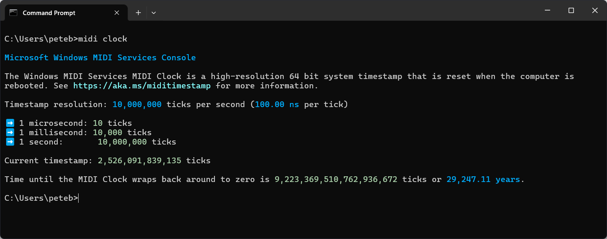

# Windows MIDI Services Console

If you have the midi console installed, you can invoke it from any command prompt using `midi`. We recommend using [Windows Terminal](https://aka.ms/terminal) for the best experience.

## Where to Get it

The Windows MIDI Services console is delivered as part of the SDK Runtime and Tools installer. While in preview, this is available on our [GitHub releases page](https://aka.ms/midireleases).

## General Information

### Commands vs Options

MIDI Console commands are words with no symbol prefix. For example `endpoint` or `send-message-file`. Options are prefixed with two dashes if you use the full word, or a single dash if you use the single-letter abbreviation. For example `--help` or `-h`. There is no statement completion built in to the console, but there are some supported abbreviations for commands. These are not yet fully documented but are present in the Program.cs in the console source code.

### "Ports" vs "Endpoints"

In MIDI 1.0, specifically USB MIDI 1.0, a connected device would have a single input and single output stream. Inside that stream are packets of data with virtual cable numbers. Those numbers (16 total at most) identify the "port" the data is going to. Operating systems would then translate those into input and output ports. Those cable numbers were hidden from users.

MIDI 2.0 does not have a concept of a port. Instead, you always work with the stream itself. The group number, which is in the MIDI message now, is the moral equivalent of that cable number.

So where you may have seen a device with 5 input and 5 output ports in the past, you will now see a **single bidirectional UMP Endpoint stream** with 5 input groups and 5 output groups. We know this can take some getting used to, but it enables us to use MIDI 1.0 devices as though they are MIDI 2.0 devices, and provide a unified API.

## See the Current Timestamp and Frequency

If you want to see the MIDI clock we're using for timestamps and message scheduling, you can use the `time` command. It will display the current timestamp in ticks, and the number of ticks per second (the resolution)

```
midi time
midi clock
```


## Technical Information

The Windows MIDI Services Console app has been developed using C#, .NET 8, the MIT-licensed open source [Spectre.Console](https://spectreconsole.net/) library, and the Microsoft-developed open source [C#/WinRT](https://learn.microsoft.com/windows/apps/develop/platform/csharp-winrt/) toolkit.

The console uses the same Windows MIDI Services WinRT APIs available to other desktop applications. Its full source code is available [on our Github repo](https://aka.ms/midirepo). Pull-requests, feature requests, and bug reports welcome. The project is open source, but we request that instead of forking it to create your own version, you consider contributing to the project.
