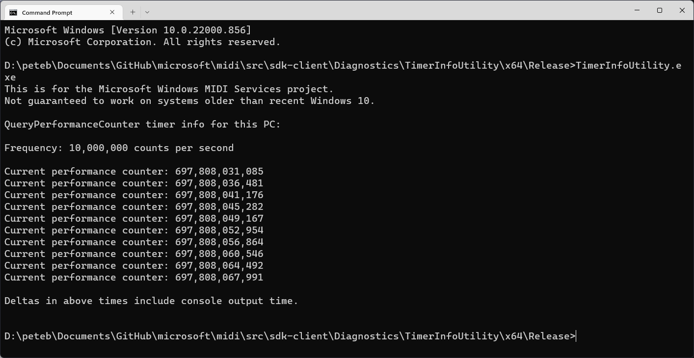
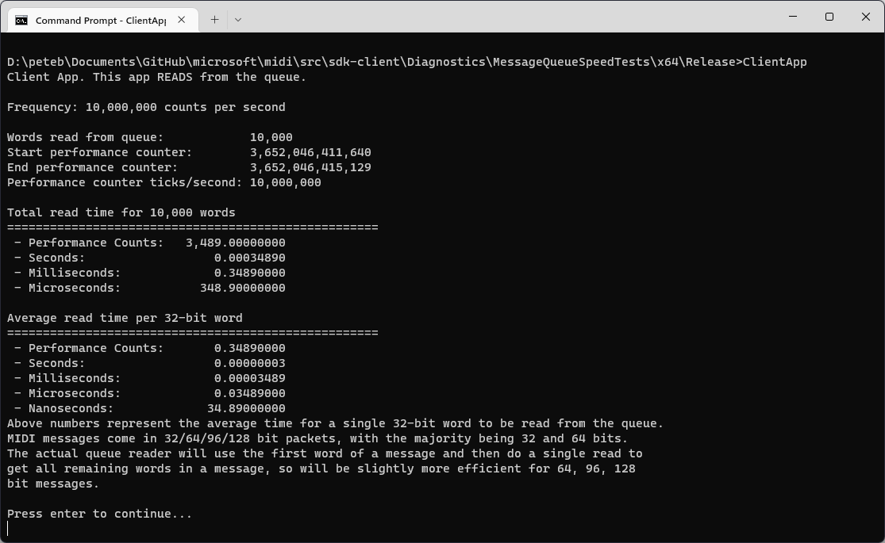

# Diagnostics

PC performance diagnostics specific to fundamentals use in MIDI.

## Timer Utility

Scheduled MIDI message sending uses the high-resolution system counters provided by QueryPerformanceCounter. The resolution of this counter varies by system, as does the call latency. In modern Windows 10 and 11 systems, this is generally not an issue. However, to be sure, you can run the TimerInfoUtility command-line tool to inspect your own system. (We'll likely put similar functionality into the settings app in the future.)

## Queue Speed Profiler Utility

This does some simple tests to check the speed of cross-process message queues (memory mapped files) on your PC. This is not something to agonize over, but rather something to use to verify message transmission speed from the client apps to the Windows service. There are many other places where performance can be impacted positively or negatively, but this is the one closest to the client applications (like your DAW).

Be sure to compile in **release mode** as there's a huge performance difference between debug and release builds of the executables.

Steps:

1. Run the server exe and let it complete. Don't hit enter to remove the queue just yet
2. Run the client exe and let it complete. Hit enter to close the app after you have the info you want.
3. Hit Enter in the server app to remove the queue and file.

This is the performance on my current PC. Your performance will be different depending upon processor and memory speed, the drive being used for the mapped file, etc.

Server app (writes messages):

Client app (reads messages):

A final note: there's additional optimization in the API so this is not necessarily indicative of the exact speed of message transmission or receive for MIDI messages on your PC. Instead, it's more useful for general comparison.